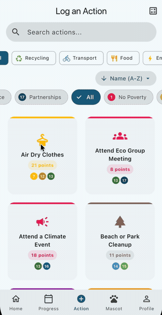
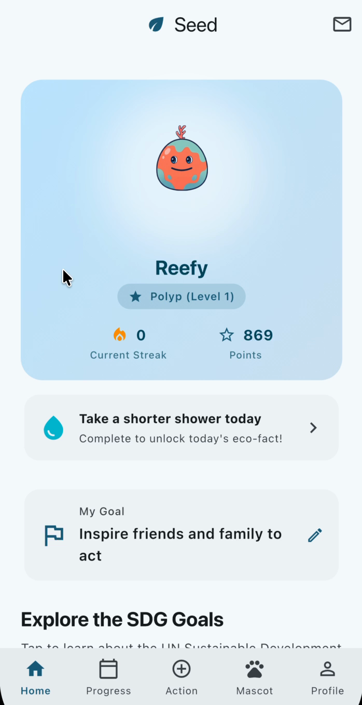
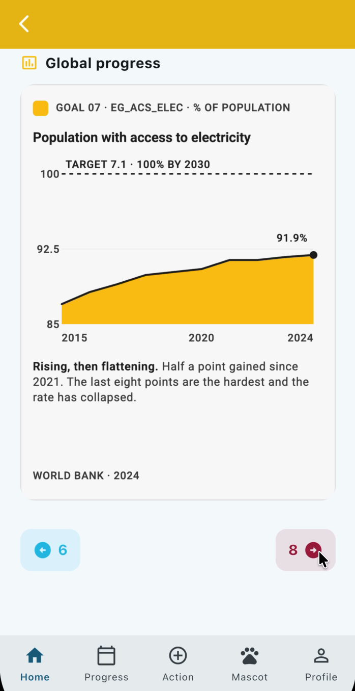
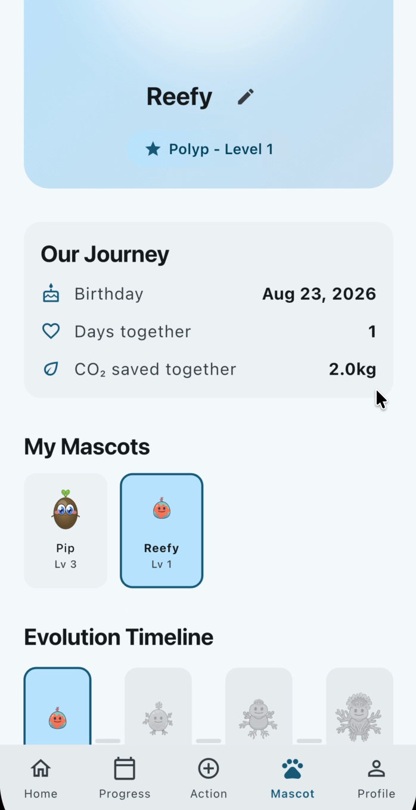
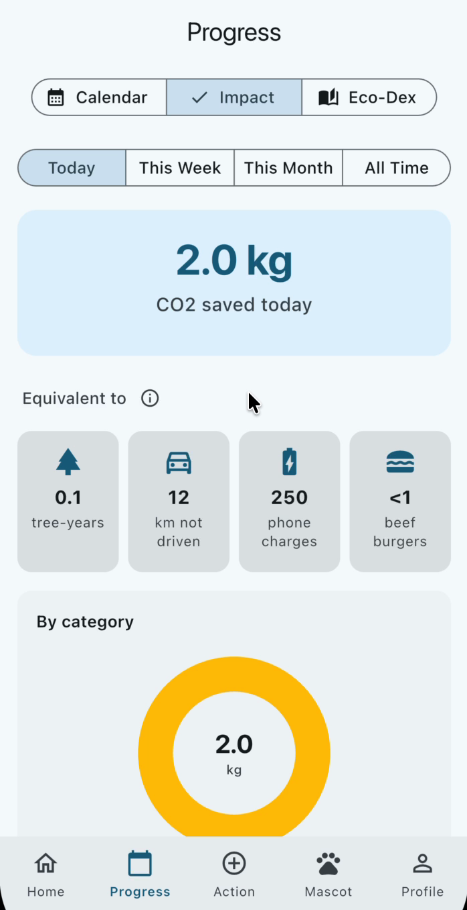
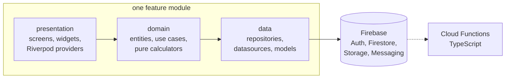

# Seed

A sustainability habit tracker for iOS and Android. Log the eco-friendly
things you already do, see the CO2 you avoided, and raise a mascot that
grows as you keep it up.

<p align="center">
  
</p>

## What it does

- **Log an action** from a library of thoroughly researched actions, or define your
  own. Points scale with the CO2 avoided, so a week without a car is worth
  more than a week of remembering a tote bag.
- **Raise a mascot** through increasing levels and evolution stages, animated in
  Rive.
- **Work out your own numbers** with the food and transport calculators. Each
  has a methodology screen showing the emission factors it used.
- **Follow all 17 UN Sustainable Development Goals**, each with an original
  progress chart built from UN indicator data.
- **Keep going** with daily and multi-day challenges, a unique Eco-Dex to
  fill in, and a sourced sustainability fact for every day of the year.
- **In multiple languages.** Currently English, Japanese and Spanish.

| Home | SDG progress | Mascot | Impact |
|:---:|:---:|:---:|:---:|
|  |  |  |  |

## How it is built

Flutter 3.44 on Dart 3.8. Riverpod 3 with code generation for state,
go_router 17 for navigation, Freezed 3 for immutable models, fl_chart for
charts, Rive for the mascot. Firebase for Auth, Firestore, Storage,
Messaging, Analytics, Crashlytics, Performance and App Check. Cloud
Functions in TypeScript.

Clean Architecture, one module per feature, three layers in each, with a
barrel file as the module's public API:



The full screen and navigation map is in [Plan/APP_PAGES.md](Plan/APP_PAGES.md);
the architecture and data models are in
[Plan/PLAN_MASTER.md](Plan/PLAN_MASTER.md).

## Data integrity

A habit tracker that invents its numbers is a toy. Every figure a user sees
here is traceable to a named source.

- **Eco facts** carry a source name per locale plus a source URL.
  [Plan/AUDIT_FACT_DATA.md](Plan/AUDIT_FACT_DATA.md) sets the bar a fact has
  to clear before it ships.
- **CO2 factors** are sourced against DEFRA, EPA and Poore & Nemecek, recorded
  per action, and audited against
  [Plan/AUDIT_ACTION_DATA.md](Plan/AUDIT_ACTION_DATA.md). The calculators
  expose their methodology so a user can check the arithmetic.
- **The 17 SDG progress charts** are original artwork plotted from the UN SDG
  Global Database at the World aggregate. Each names its custodian agency and
  reference year on the card itself, so the citation travels with the image.
  They exist because the UN report pages they replaced could not be
  redistributed.

Sources and terms for all third-party content are recorded in
[ATTRIBUTIONS.md](ATTRIBUTIONS.md).

## Testing and CI

- Unit and widget tests run against `fake_cloud_firestore`, with `mocktail`
  for mocks.
- [firestore.rules](firestore.rules) validates every point delta against the
  action library, makes the action log immutable once written, and rate limits
  submissions. Rules are invisible to the Dart suite, so Jest tests
  exercise them against the Firestore emulator.
- `flutter analyze --fatal-infos` over `flutter_lints` with `strict-casts`,
  `strict-inference` and `strict-raw-types`.
- GitHub Actions. `ci.yml` runs three jobs: Flutter analyze and test, Cloud
  Functions (Node 22, ESLint, tsc, Jest), and the rules suite on a Temurin 21
  JDK. `build.yml` builds an Android APK on every pull request into `main`.
- Release builds are obfuscated with split debug info.

## Running it

A clone will not build. The Firebase config
(`lib/firebase_options.dart`, `google-services.json`,
`GoogleService-Info.plist`) is deliberately untracked, so running the app
needs your own Firebase project and a `flutterfire configure` pass. Platform
notes: [Plan/SETUP_ANDROID.md](Plan/SETUP_ANDROID.md),
[Plan/SETUP_IOS.md](Plan/SETUP_IOS.md).

With that in place:

```bash
flutter pub get && flutter test
```

Generated files (`*.g.dart`, `*.freezed.dart`, localisations) are committed,
so CI never runs codegen. Regenerate locally after editing any `@riverpod` or
`@freezed` class:

```bash
dart run build_runner build && flutter gen-l10n
```

The repository ships a pre-commit hook that runs a secrets guard, formatting,
analysis and ARB validation. Enable it once per clone:

```bash
git config core.hooksPath .githooks
```

## Licence and attribution

Proprietary, all rights reserved. [LICENSE](LICENSE) grants viewing,
evaluation and personal study only. This is not open source, and pull requests are not accepted. Third-party content is
not covered by that grant and is documented, with its own terms, in
[ATTRIBUTIONS.md](ATTRIBUTIONS.md).
